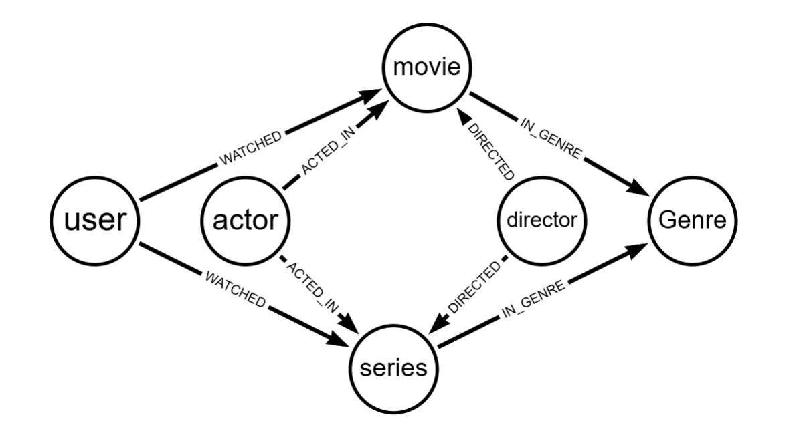

# Modelagem de Dados de Recomendação - Neo4j

Este repositório contém um script robusto em Cypher para a criação e populamento de um banco de dados de grafos Neo4j, focado em um sistema de recomendação de filmes e séries.

## 📋 Visão Geral do Projeto

O objetivo deste projeto é fornecer uma base de dados sólida e estruturada para análise de interações entre usuários e conteúdos multimídia. O script foi desenhado seguindo as melhores práticas de Engenharia de Dados, garantindo integridade, performance e idempotência.

## 🏗️ Modelo de Dados

### Nós (Nodes)
O modelo consiste nas seguintes entidades principais:

*   **User**: Representa os usuários da plataforma.
    *   Propriedades: `id` (Unique), `name`.
*   **Movie**: Filmes catalogados.
    *   Propriedades: `id` (Unique), `title`, `year`.
*   **Series**: Séries catalogadas.
    *   Propriedades: `id` (Unique), `title`, `year`.
*   **Genre**: Gêneros dos conteúdos (ex: Action, Drama).
    *   Propriedades: `name` (Unique).
*   **Actor**: Atores e atrizes.
    *   Propriedades: `id` (Unique), `name`.
*   **Director**: Diretores(as).
    *   Propriedades: `id` (Unique), `name`.

### Relacionamentos (Relationships)

*   `(:User)-[:WATCHED {rating: Float}]->(:Movie|:Series)`: Indica que um usuário assistiu a um conteúdo. Possui a propriedade `rating` para armazenar a avaliação.
*   `(:Movie|:Series)-[:IN_GENRE]->(:Genre)`: Classifica o conteúdo em um ou mais gêneros.
*   `(:Actor)-[:ACTED_IN]->(:Movie|:Series)`: Associa atores aos conteúdos onde atuaram.
*   `(:Director)-[:DIRECTED]->(:Movie|:Series)`: Associa diretores aos seus trabalhos.

## 🚀 Engenharia e Boas Práticas

Este script foi desenvolvido com foco em robustez e manutenibilidade:

1.  **Idempotência (MERGE vs CREATE)**
    *   Utilizamos exclusivamente o comando `MERGE` para a criação de nós e relacionamentos. Isso permite que o script seja executado múltiplas vezes sem criar duplicatas indesejadas no banco de dados.

2.  **Integridade e Performance (Constraints)**
    *   Antes de qualquer inserção, o script define `CONSTRAINTS` de unicidade para os IDs de todas as entidades principais.
    *   Isso não apenas garante a integridade dos dados (impedindo IDs duplicados), mas também cria índices automaticamente, acelerando drasticamente as operações de busca e correspondência (`MATCH`/`MERGE`).

3.  **Modelagem Semântica**
    *   Distinção clara entre `Movie` e `Series`, permitindo queries específicas (ex: "Séries mais assistidas") sem perder a capacidade de queries genéricas (visto que ambos compartilham estruturas similares de conexão).

## 📊 Estatísticas do Dataset

O script popula inicialmente o banco com:
*   **10 Usuários** com perfis variados.
*   **10 Conteúdos** (6 Filmes e 4 Séries), incluindo sucessos como *Inception*, *Breaking Bad* e *Parasite*.
*   **Dados de Staff**: Diretores renomados (Nolan, Tarantino) e elenco principal.
*   **Interações**: Relacionamentos `WATCHED` pré-definidos para simular preferências de usuários.

## ▶️ Como Executar

1.  Abra o Neo4j Browser ou Cypher Shell.
2.  Certifique-se de que o banco está ativo.
3.  Copie e cole o conteúdo do arquivo `script.cypher`.
4.  Execute todo o script de uma vez.

> **Nota:** Se estiver rodando linha a linha ou em blocos, certifique-se de executar a seção de **CONSTRAINTS** primeiro.
